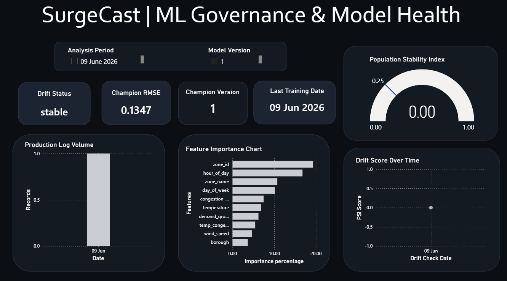
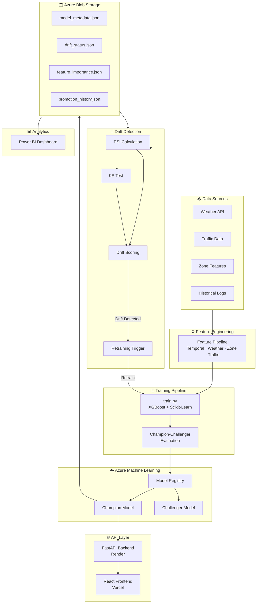
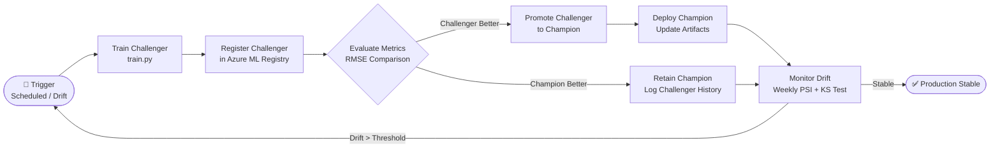

# SurgeCast – Intelligent Demand Surge Forecasting & MLOps Platform

<div align="center">


**A production-grade, end-to-end MLOps platform for transportation demand surge prediction — demonstrating the full ML engineering lifecycle from training to governance.**

[Live Demo (Frontend)](https://surge-predictor.vercel.app/) · [Backend API](https://surge-predictor-backend.onrender.com/docs) · [Report an Issue](https://github.com/adwaiths05/surge-predictor/issues)

</div>

---

## 📌 Project Overview

**SurgeCast** is a complete, production-ready MLOps system that forecasts transportation demand surges using weather patterns, traffic conditions, temporal signals, and geographic zone-level features. Designed to mirror real-world ML engineering workflows, SurgeCast goes far beyond a standalone model — it implements a full ML lifecycle with automated monitoring, drift detection, model governance, and CI/CD pipelines.

> **The goal is not just to predict surges — it's to build, deploy, monitor, and maintain a machine learning system that operates reliably in production.**

### What makes this production-grade?

| Capability | Implementation |
|---|---|
| 🎯 **Model Training** | XGBoost + Scikit-Learn pipeline with feature engineering |
| ☁️ **Cloud Deployment** | Azure Machine Learning + Azure Blob Storage |
| 🏆 **Champion-Challenger** | Automated model comparison and promotion workflows |
| 📡 **Drift Detection** | PSI + KS Test monitoring on a weekly schedule |
| 🔄 **Automated Retraining** | Triggered by drift thresholds or scheduled runs |
| 📊 **Analytics Dashboard** | Power BI connected to Azure Blob Storage |
| 🔁 **CI/CD Automation** | GitHub Actions for train, evaluate, promote, and monitor |
| 🌐 **Full-Stack API** | FastAPI backend + React/TypeScript frontend |

---

## 📊 Dashboard Preview

### ML Governance & Model Health Dashboard



The Power BI dashboard is connected **directly to Azure Blob Storage** and automatically refreshes whenever governance artifacts are updated. It provides a real-time view into model health, drift status, and production performance.

**Dashboard Visuals:**
- 🏆 Champion Model Version & RMSE
- 📅 Last Training Date
- 🚨 Drift Status (Active / Stable)
- 📈 PSI Gauge & Drift Score Trend
- 🔍 Feature Importance Breakdown
- 📦 Production Log Volume over time

---

## 🏗️ System Architecture



---

## 🔄 MLOps Workflow



---

## ⚡ Core Features

### 🎯 Demand Surge Prediction

Predicts transportation demand surges using a combination of:

| Feature Category | Examples |
|---|---|
| **Weather** | Temperature, precipitation, wind speed, conditions |
| **Traffic** | Congestion index, historical traffic volume, peak indicators |
| **Temporal** | Hour of day, day of week, month, is-holiday, is-weekend |
| **Geographic** | Borough, zone ID, zone name, spatial clustering |

The model outputs a **surge probability score** and **demand multiplier** for a given zone and time window, enabling proactive capacity planning.

---

### 🏆 Champion-Challenger Framework

SurgeCast implements a rigorous **Champion-Challenger deployment pattern** to ensure only the best-performing model serves production traffic:

```
New Training Run
      │
      ▼
┌─────────────────┐     ┌──────────────────┐
│  Challenger 🆕  │────▶│  Champion 👑      │
│  (New Model)    │     │  (Production)     │
│  RMSE: X.XX     │     │  RMSE: Y.YY       │
└─────────────────┘     └──────────────────┘
         │
         ▼
  Compare RMSE + Metrics
         │
   ┌─────┴──────┐
   │            │
 Better      Worse
   │            │
   ▼            ▼
 Promote     Retain
 Challenger  Champion
```

- **Challenger** models are trained and evaluated before any promotion
- **Promotion** only occurs when the challenger demonstrates statistically improved performance
- All promotion decisions are logged to `promotion_history.json` for full auditability

---

### 📡 Drift Detection & Automated Retraining

Weekly automated monitoring checks for **data drift** that could degrade model performance:

| Metric | Method | Threshold |
|---|---|---|
| **PSI** (Population Stability Index) | Distribution comparison of key features | `PSI > 0.2` triggers retraining |
| **KS Test** | Kolmogorov-Smirnov statistical test | p-value significance |
| **Drift Score** | Composite scoring across all features | Configurable per deployment |

When drift is detected, the retraining workflow is **automatically triggered** via GitHub Actions, training a new challenger against the drifted feature distribution.

---

### 🗂️ Model Governance & Artifacts

All governance state is persisted as JSON artifacts in **Azure Blob Storage**, enabling Power BI connectivity and full audit trails:

| Artifact | Purpose |
|---|---|
| `model_metadata.json` | Champion version, RMSE, training date, feature list, model algorithm |
| `drift_status.json` | Latest drift check result: PSI score, KS result, drift flag, timestamp |
| `drift_history.json` | Historical log of all drift checks with scores per feature |
| `feature_importance.json` | Feature importance rankings from the champion model |
| `promotion_history.json` | Record of every model promotion: old vs new champion, RMSE delta |
| `challenger_history.json` | Log of all challengers evaluated: metrics, outcome (promoted/rejected) |

---

## ☁️ Azure Components

| Service | Purpose |
|---|---|
| **Azure Machine Learning** | Model training environment, experiment tracking, model registry, endpoint management |
| **Azure Blob Storage** | Persistent store for governance artifacts, model files, encoders, and logs |
| **GitHub Actions** | CI/CD orchestration for training, evaluation, promotion, and drift monitoring pipelines |
| **Power BI** | Live monitoring dashboard connected directly to Azure Blob Storage |

---

## 📊 Power BI Monitoring Dashboard

The dashboard is built in **Power BI** and connected directly to Azure Blob Storage via native connector. It refreshes automatically when governance artifacts are updated by any CI/CD pipeline run.

### ML Governance & Model Health KPIs

| KPI | Source Artifact |
|---|---|
| Champion Version | `model_metadata.json` |
| Champion RMSE | `model_metadata.json` |
| Last Training Date | `model_metadata.json` |
| Drift Status | `drift_status.json` |

### Dashboard Visuals

- **PSI Gauge** — Real-time population stability index with color-coded threshold bands (Stable / Warning / Critical)
- **Feature Importance Bar Chart** — Top features ranked by importance score from `feature_importance.json`
- **Drift Score Trend Line** — Historical drift scores over time from `drift_history.json`
- **Production Log Volume** — Prediction volume over time to detect traffic anomalies
- **Promotion Timeline** — Visual history of champion-to-challenger promotions

---

## 🔁 CI/CD Pipelines

All automation is orchestrated via **GitHub Actions** with three core workflows:

### 🔬 Retraining Workflow (`retrain.yml`)
Triggered manually, on schedule, or by drift detection:
```
1. Pull latest data from Azure Blob Storage
2. Run feature engineering pipeline
3. Train XGBoost challenger model
4. Evaluate RMSE and validation metrics
5. Upload challenger model + artifacts to Azure Blob Storage
6. Log challenger metadata to challenger_history.json
```

### 🏆 Promotion Workflow (`promote.yml`)
Runs after retraining; decides champion vs challenger:
```
1. Load champion metrics from model_metadata.json
2. Load challenger metrics from latest training run
3. Compare RMSE (and optional secondary metrics)
4. If challenger RMSE < champion RMSE:
   a. Promote challenger → champion
   b. Update model_metadata.json
   c. Append to promotion_history.json
   d. Deploy updated champion artifact
5. Else: log rejection to challenger_history.json
```

### 📡 Drift Monitoring Workflow (`check_drift.yml`)
Runs on a **weekly schedule**:
```
1. Fetch recent prediction logs from Azure Blob Storage
2. Load reference distribution (training data statistics)
3. Compute PSI for each monitored feature
4. Run KS Test for distributional shift
5. Compute composite drift score
6. Update drift_status.json and drift_history.json
7. If drift_score > threshold: trigger retraining workflow
```

### ✅ CI Checks (on every PR)
- Python linting with `flake8`
- Unit tests with `pytest`
- Artifact schema validation
- Model artifact integrity checks

---

## 🧰 Tech Stack

### Machine Learning


### MLOps & Cloud


### Backend & Frontend


### Analytics & Deployment

-000000?style=flat-square&logo=vercel&logoColor=white)
-46E3B7?style=flat-square&logo=render&logoColor=black)

---

## 📁 Repository Structure

```
surge-predictor/
├── .github/
│   └── workflows/
│       ├── check_drift.yml       # Weekly drift monitoring pipeline
│       ├── retrain.yml           # Challenger training pipeline
│       └── promote.yml           # Champion-Challenger promotion logic
├── training/
│   ├── train.py                  # Core model training script
│   ├── drift.py                  # PSI + KS drift detection
│   ├── promotion.py              # Champion-Challenger comparison logic
│   ├── metadata.py               # Governance artifact management
│   └── pseudo_label.py           # Semi-supervised retraining support
├── backend/
│   └── ...                       # FastAPI application (deployed on Render)
├── frontend/
│   └── ...                       # React + TypeScript app (deployed on Vercel)
├── artifacts/
│   ├── model.pkl                 # Serialized champion model
│   ├── model_metadata.json       # Champion version, RMSE, training date
│   ├── drift_status.json         # Latest drift check result
│   ├── drift_history.json        # Historical drift scores
│   ├── feature_importance.json   # Feature importance rankings
│   ├── promotion_history.json    # Promotion audit log
│   └── challenger_history.json   # Challenger evaluation history
├── assets/
│   └── dashboard.png             # Power BI dashboard screenshot
├── data/                         # Raw and processed datasets
├── tests/                        # Unit and integration tests
├── requirements.txt
└── Dockerfile
```

---

## 🚀 Getting Started

### Prerequisites

- Python 3.10+
- Azure ML Workspace + Azure Blob Storage configured
- Node.js 18+ (for frontend)

### Backend Setup

```bash
# Clone the repository
git clone https://github.com/adwaiths05/surge-predictor.git
cd surge-predictor

# Install dependencies
pip install -r requirements.txt

# Configure environment variables
cp .env.example .env
# Fill in Azure credentials and Blob Storage connection string

# Run the FastAPI backend
uvicorn backend.main:app --reload
```

### Frontend Setup

```bash
cd frontend
npm install
npm run dev
```

### Running the Training Pipeline

```bash
# Train a new challenger model
python -m training.train

# Check drift against production distribution
python -m training.drift

# Evaluate and promote challenger if better
python -m training.promotion
```

### Deployment

| Component | Platform | Notes |
|---|---|---|
| **Frontend** | [Vercel](https://vercel.com) | Automatic deploy on push to `main` |
| **Backend API** | [Render](https://render.com) | FastAPI + Dockerfile deployment |
| **Artifacts** | Azure Blob Storage | Synced via GitHub Actions |

---

## 🔮 Future Improvements

| Enhancement | Description |
|---|---|
| 🌊 **Real-Time Streaming** | Azure Event Hub integration for live prediction streams |
| 📉 **MLflow Tracking** | Experiment tracking with MLflow for richer metric logging |
| ⏪ **Automated Rollback** | Automatic rollback to previous champion if latency or error rate spikes |
| 🧠 **Advanced Explainability** | SHAP-based explanation dashboards embedded in the frontend |
| 📦 **Feature Store** | Centralized feature store for consistent training/serving features |
| 🔔 **Alerting** | Slack/email alerts on drift detection and promotion events |

---

## 🎯 Key Skills Demonstrated

| Domain | Skills |
|---|---|
| **Machine Learning Engineering** | Feature engineering, XGBoost, Scikit-Learn pipelines, model serialization |
| **MLOps** | Champion-Challenger, automated retraining, drift detection, model governance |
| **Azure Cloud** | Azure Machine Learning, Azure Blob Storage, cloud artifact management |
| **Model Monitoring** | PSI, KS Test, drift scoring, composite health metrics |
| **CI/CD** | GitHub Actions workflows for train, evaluate, promote, and monitor |
| **Analytics** | Power BI dashboard design, direct Azure Blob connectivity |
| **Backend Development** | FastAPI REST API, production deployment on Render |
| **Frontend Development** | React, TypeScript, Tailwind CSS, deployed on Vercel |

---

## 💼 Why This Project Matters

> *Most ML portfolios stop at the Jupyter notebook. SurgeCast doesn't.*

Building a model that achieves strong validation RMSE is only 20% of the job in production ML. The remaining 80% — the part that separates ML **engineers** from ML **researchers** — is everything that happens after the first training run:

- **Does the model degrade over time?** SurgeCast monitors this with weekly drift detection.
- **How do you safely update a production model?** SurgeCast implements a Champion-Challenger pattern with full audit trails.
- **Who decides when to retrain?** SurgeCast automates this decision with configurable PSI thresholds.
- **How does the business see model health?** SurgeCast delivers a live Power BI dashboard connected to Azure Blob Storage.
- **How does code get to production safely?** SurgeCast uses GitHub Actions CI/CD for every stage of the lifecycle.

This project demonstrates **end-to-end ownership of the ML lifecycle** — from raw feature engineering to cloud deployment, automated monitoring, and governance reporting. It mirrors the practices used by ML engineering teams at scale, and reflects the kind of thinking that makes the difference between a model in a notebook and a model that runs reliably in production for months.

---

<div align="center">

**Built by [Adwaith S](https://github.com/adwaiths05)** · Demonstrating production-grade ML Engineering & MLOps

⭐ Star this repository if you found it useful!

</div>
